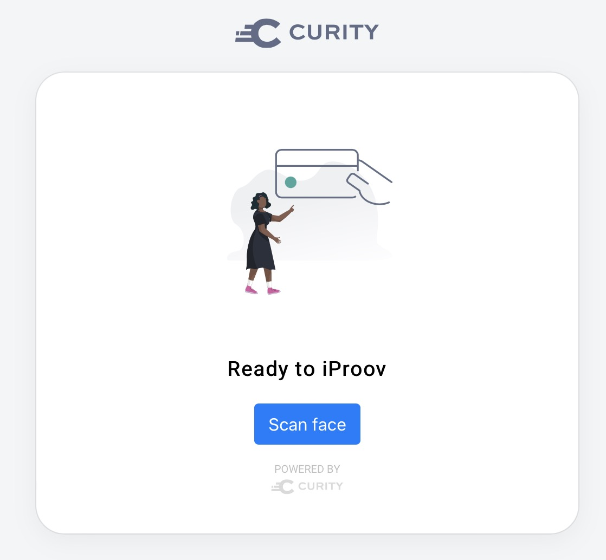
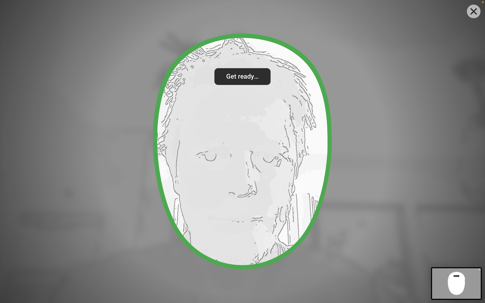

# iProov Authentication Action Plugin

A custom authentication action plugin for the Curity Identity Server leveraging the [iProov Biometrics Web SDK](https://github.com/iProov/web) for facial biometric scanning. The action can be added after an authenticator and will invoke the use of the camera on the user’s device to scan a person’s face for liveness check and verification.

## Intro
This plugin leverages the iProov Biometrics Web SDK for the facial scanning. The SDK handles the frontend
mechanism of invoking the system camera to scan a user’s face. This is then coupled with the iProov REST API
where the scanning result is sent together with a token. The response will indicate if the user is either
successfully enrolled or successfully verified.

Before a scanning event takes place an iProov token needs to be obtained. The plugin handles this
automatically in the background. The plugin will first attempt to enroll a user and with that initially
obtain an enrollment token. If the user is not enrolled the process of enrollment continues and the user
is prompted to scan their face. An iProov validation token is then obtained and sent in a request to the
iProov REST API together with the facial scan. If the validation response is successful, the user is enrolled
and the action completes.

If the response from the initial request for an enrollment token indicates that the user is already enrolled
the plugin will automatically obtain a verification token. After that the steps are the same as for enrollment,
the user scans their face, and the verification token is sent to iProov together with the scan result. With a
successful verification response the plugin provides a set of subject attributes than can for example be used as
claim values when issuing a token.

> **Camera Permission**
>
> The user might need to grant the browser the permission to use the system camera before scanning for the
> first time.

### Attributes

The subject attributes returned with a successful verification:

| Attribute          | Description                                                          |
|--------------------|----------------------------------------------------------------------|
| `feedback`         | A fixed feedback code for making logical decisions (see table below) |
| `reason`           | An English description of the reason for the event                   |
| `type`             | The type of authentication (enrol or verify)                         |
| `passed`           | Indicates if the enrollment r verification succeeded                 |
| `token`            | The token used to validate or verify a user                          |
| `is_native_bridge` | Boolean value if event originates from the native bridge             |
| `assurance_type`   |                                                                      |

#### Feedback

| Feedback            | Reason                                                |
|---------------------|-------------------------------------------------------|
| `user_timeout`      | The user started the claim but did not stream in time |
| `too_bright`        | Ambient light too strong or screen brightness too low |
| `too_dark`          | Your environment appears too dark                     |
| `too_much_movement` | Please keep still                                     |
| `misaligned_face`   | Keep your face in the oval                            |
| `eyes_closed`       | Keep your eyes open                                   |
| `face_too_far`      | Move your face closer to the screen                   |
| `face_too_close`    | Move your face farther from the screen                |
| `sunglasses`        | Remove sunglasses                                     |
| `obscured_face`     | Remove any face coverings                             |
| `not_supported`     | This device is not supported                          |

## Configuration

An iProov Portal account is needed in order to use the iProov Web SDK and call the iProov REST API. This will
allow the creation of the `iProov API Key` and `iProov API Secret`.

In addition to that, access is needed to the private iProov NPM registry. The process for obtaining access
is outlined in the [iProov Web SDK documentation](https://github.com/iProov/web#npm-package).

Configuration | Description 
--- | --- 
`iProov API Key` | The iProov API Key that can be obtained from iProov 
`iProov API Secret` | The iProov API Secret that can be obtained from iProov
`iProov Base URL` | The iProov Base URL. The default value is `/api/v2`. 
`iProov Tenant` | The iProov Tenant to use. The default value is `us.rp.secure.iproov.me`.
`Http Client` | An Http Client

## Building the Plugin

You can build the plugin by issuing the command ``./gradlew buildPlugin``. This will create a `build/iProov` folder with:
- the plugin JAR bundled with all the required frontend dependencies,
- all the required dependency JARs

## Installing the Plugin

To install the plugin, copy the `build/iProov` dir into `${IDSVR_HOME}/usr/share/plugins/iproov` on each node, including the admin node.

If you're deploying using Docker, make sure that the `build/iProov` is copied or mounted to `/opt/idsvr/usr/share/plugins/iproov`.

For more information about installing plugins, refer to the [curity.io/plugins](https://support.curity.io/docs/latest/developer-guide/plugins/index.html#plugin-installation).

## Installation Script

If you're running a local instance of the Curity Identity Server, you can use the `install-local.sh` script to build and install the plugin. Open the script to configure the installation location of the Curity Identity Server before executing.

## License

This plugin and its associated documentation is listed under the [Apache 2 license](https://github.com/curityio/microblink-scan-id/blob/main/LICENSE).

## More Information

Please visit [curity.io](https://curity.io/) for more information about the Curity Identity Server.

Copyright (C) 2023 Curity AB.