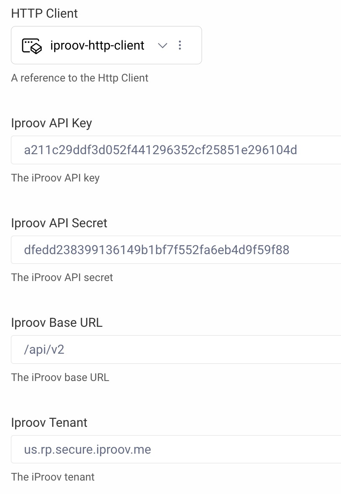

# iProov Authentication Action Plugin

A custom authentication action plugin for the Curity Identity Server leveraging the [iProov Biometrics Web SDK](https://github.com/iProov/web) for facial biometric scanning. The action can be added after an authenticator and will invoke the use of the camera on the users device to scan a persons face for liveness check and verification.

## Configuration

Configuring the action requires
- iProov API Key
- iProov API Secret
- iProov Base URL
- iProov Tenant
- Http Client

Configuration | Description 
--- | --- 
`iProov API Key` | The iProov API Key that can be obtained from iProov 
`iProov API Secret` | The iProov API Secret that can be obtained from iProov
`iProov Base URL` | The iProov Base URL. The default value is `/api/v2`. 
`iProov Tenant` | The iProov Tenant to use. The default value is `us.rp.secure.iproov.me`.
`Http Client` | An Http Client

## Building the Plugin

You can build the plugin by issuing the command ``./gradlew buildPlugin``. This will create a `build/iProov` folder with:
- the plugin JAR bundled with all the required frontend dependencies,
- all the required dependency JARs

## Installing the Plugin

To install the plugin, copy the `build/iProov` dir into `${IDSVR_HOME}/usr/share/plugins/iproov` on each node, including the admin node.

If you're deploying using Docker, make sure that the `build/iProov` is copied or mounted to `/opt/idsvr/usr/share/plugins/iproov`.

For more information about installing plugins, refer to the [curity.io/plugins](https://support.curity.io/docs/latest/developer-guide/plugins/index.html#plugin-installation).

## Installation Script

If you're running a local instance of the Curity Identity Server, you can use the `install-local.sh` script to build and install the plugin. Open the script to configure the installation location of the Curity Identity Server before executing. 

## License

This plugin and its associated documentation is listed under the [Apache 2 license](https://github.com/curityio/microblink-scan-id/blob/main/LICENSE).

## More Information

Please visit [curity.io](https://curity.io/) for more information about the Curity Identity Server.

Copyright (C) 2023 Curity AB.
